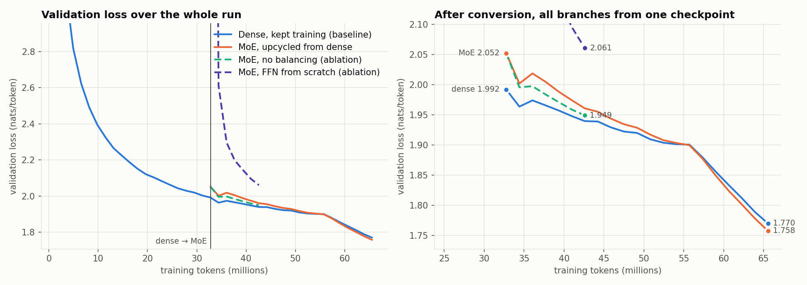
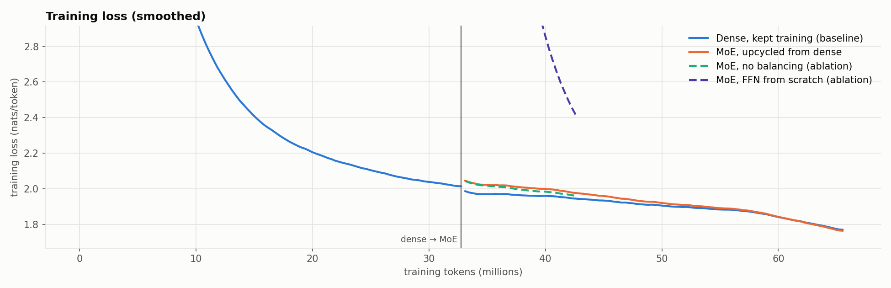
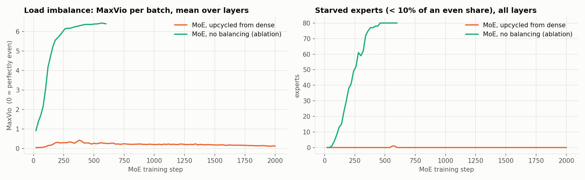
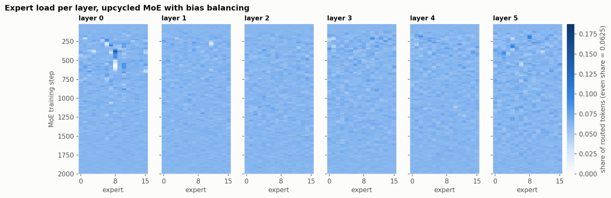
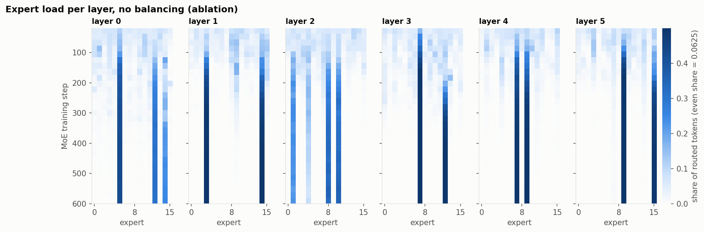

# Dense → Mixture-of-Experts: growing a trained model and continuing to train

**ERA V5, Session 14 assignment:** *"Train a Linear model and convert that into an MoE! Your call on
model size and data trained on, but must show they continue to train and reduce loss!"*

This repo trains a small dense model on TinyStories. "Dense" here means one feed-forward network per
layer, the "linear model" from class. It then converts ("upcycles") that model into a mixture-of-experts
model using the recipe from the session and keeps training it. A second branch keeps training the dense
model from the same checkpoint, on the same data stream and learning-rate schedule, so the MoE has a fair
baseline to beat.

## Results

| | dense phase | conversion | +2,000 steps (+32.8M tokens) |
|---|---|---|---|
| **MoE, upcycled** (24.5M total / 8.0M active) | val **1.992** after 32.8M tokens | 1.992 → **2.052** | **1.758** |
| dense, kept training (8.0M) | (same model) | — | 1.770 |



* **The MoE keeps training and its loss keeps falling.** It goes from 2.052 right after conversion to
  **1.758** after 2,000 more steps (train loss 2.04 → 1.75). The conversion itself costs only +0.060 nats,
  and the model wins most of it back within 100 steps (2.002).
* **The MoE ends below the dense model at the same compute per token.** Both run 8.0M active parameters,
  and the MoE finishes 0.012 nats lower (perplexity 5.80 vs 5.87). The MoE trails at first while its new
  routers settle, catches up at step 1,400 and then pulls ahead. Its lead grows through the decay phase.
* **Load stays balanced and no expert dies.** At the end every expert receives 0.94–1.08× its even share
  in every layer. Without balancing, routing collapses and 80 of the 96 experts are starved within 600
  steps ([ablation](#ablations)).
* **The experts learn token roles, not topics.** Middle layers group adjectives, verbs of
  thinking and speaking, and verbs of wanting, as the session predicts
  ([analysis](#what-the-experts-learned)).

Validation loss on 327k held-out tokens (40 fixed batches) for both branches. Step 0 is the moment both
branches leave the same dense checkpoint:

| step after conversion | 0 | 100 | 300 | 600 | 1000 | 1300 | **1400** | 1600 | 1800 | **2000** |
|---|---|---|---|---|---|---|---|---|---|---|
| dense, kept training | 1.992 | 1.964 | 1.966 | 1.940 | 1.920 | 1.901 | 1.900 | 1.856 | 1.812 | **1.770** |
| MoE, upcycled | 2.052 | 2.002 | 2.005 | 1.961 | 1.929 | 1.903 | 1.900 | 1.850 | 1.802 | **1.758** |
| MoE − dense | +0.060 | +0.038 | +0.039 | +0.021 | +0.009 | +0.002 | −0.001 | −0.006 | −0.010 | **−0.012** |



## Setup

| | |
|---|---|
| Data | [TinyStories](https://huggingface.co/datasets/roneneldan/TinyStories), one training shard (529,875 stories, **117.3M tokens**) and the full validation split (21,990 stories, 4.7M tokens). Training draws random 256-token windows; all runs together use 65.5M tokens, about 0.56 of a pass over the shard |
| Tokenizer | byte-level BPE, 8,192 tokens, trained on the data (`prepare_data.py`) |
| Hardware | one NVIDIA GTX 1660 Ti laptop GPU (6 GB), thermally throttled to ~1,455 MHz |
| Precision | fp32. On this card a 4096² fp16 matmul runs at 0.42 TFLOPS against 3.58 TFLOPS in fp32, so mixed precision would be 8× *slower* |
| Batch | 64 sequences × 256 tokens = 16,384 tokens per optimizer step (32 × 2 gradient accumulation) |
| Optimizer | AdamW, β = (0.9, 0.95), weight decay 0.1, grad clip 1.0, peak lr 1e-3 |
| Schedule | warmup–stable–decay. Phase 1 warms up for 200 steps and then stays at the stable lr, so conversion happens mid-training. In phase 2 both branches re-warm for 100 steps, hold, and decay linearly to 0.1× over the last 30% |
| Speed | dense ~17.5k tok/s, MoE ~12.1k tok/s. Dense phase 31 min, dense continuation 33 min, MoE 47 min |

### Model

The model is a miniature of the session's reference model (the Qwen3-30B-A3B shape). It uses RMSNorm,
RoPE, QK-norm, grouped-query attention, SwiGLU and tied embeddings.

| | dense | MoE (upcycled) |
|---|---|---|
| layers / hidden size | 6 / 256 | 6 / 256 |
| attention | 4 query heads, 2 KV heads (GQA), head dim 64 | same, copied |
| feed-forward per layer | one SwiGLU, inner width 1,024 | 1 shared expert (512) + 16 routed experts (256 each), top-2 |
| FFN width one token uses | 1,024 | 512 + 2 × 256 = **1,024** |
| FFN width stored | 1,024 | 512 + 16 × 256 = 4,608 (**4.5×**) |
| total parameters | 8.00M | **24.54M** |
| active parameters per token | 8.00M | **8.02M** (+0.02M for the routers) |

The MoE does the same work per token as the dense model and stores 3× the parameters. This is the
trade the session describes: *compute follows the active parameters, memory follows the total.*

## How the dense model becomes a MoE

`upcycle.py` does the conversion. A dense SwiGLU layer is a sum over its inner neurons:

```
y = Σ_j  w_down[:, j] · silu(w_gate[j] · x) · (w_up[j] · x)        j = 1 … 1024
```

Each neuron is an independent (gate row, up row, down column) triple, so an expert can be built from any
subset of neurons. The recipe is the partition-style growth from Section 15. It follows Qwen1.5-MoE and
the Lightning LM's "shared expert + overlapping random halves":

```
dense FFN, 1,024 neurons, ranked by importance  E|h_j| · ‖w_down[:, j]‖  on 8 calibration batches
┌──────────────── top 512 ────────────────┬──────────────── other 512 (the pool) ─────────────┐
│ → shared expert (always on)             │ → 16 routed experts, each a random 256-subset of   │
│   the "common knowledge" every token    │   the pool. Experts overlap ~50% with each other,  │
│   needs                                 │   so they start similar but not identical         │
└─────────────────────────────────────────┴────────────────────────────────────────────────────┘
router: new 256 × 16 matrix, fp32, init std 0.002 (1/10 of normal, as in Switch)
attention, norms, embeddings: copied unchanged
```

**Why the loss barely moves at conversion.** At step 0 the router is near-uniform, so each of the 2 chosen
experts gets weight ½. Each expert holds half of the pool, so in expectation one expert reproduces ½ of the
pool's contribution. With the routed scaling factor `route_scale = pool / expert_width = 512 / 256 = 2`:

```
E[ y_moe ] = shared(x) + 2 · (½ · ½ pool(x) + ½ · ½ pool(x)) = shared(x) + pool(x) = y_dense
```

This is the job the session gives the routed scaling factor (2.5 in DeepSeek-V3): it restores the size of
the layer's output when experts are small. The AdamW moments are sliced with the same neuron plan, so
every copied weight keeps its optimizer state. 86 state tensors carry over, and only the routers start
fresh.

**Comparing conversion methods** (`compare_upcycling.py`): the same dense checkpoint is converted in
several ways and validation loss is measured immediately, with no training:

| method | val loss | change | total params | active params |
|---|---|---|---|---|
| dense model (before conversion) | 1.9920 | — | 8.0M | 8.0M |
| copy: 8 full copies, top-2 (sparse upcycling) | 1.9920 | +0.0000 | 41.0M | 12.7M |
| partition, random neurons → shared, random subsets → experts | 2.0824 | +0.0904 | 24.5M | 8.0M |
| **partition, important neurons → shared (used here)** | **2.0515** | **+0.0595** | 24.5M | 8.0M |
| partition (used here) + drop-upcycling r = 0.5 | 2.1438 | +0.1518 | 24.5M | 8.0M |
| partition (used here), route_scale 1 instead of 2 | 2.0908 | +0.0988 | 24.5M | 8.0M |
| no shared expert: 16 experts × 512, top-2 | 2.1897 | +0.1977 | 41.1M | 8.0M |
| scratch: attention copied, FFN re-initialised | 10.0132 | +8.0211 | 24.5M | 8.0M |

Plain copying is exactly function-preserving, but every token then runs two full FFNs, which costs 1.6×
the dense model's compute. Among the methods that keep compute per token equal to the dense model, ranking neurons by
importance and scaling the routed output by 2 lose the least. Drop-upcycling redraws half of each
expert's neurons, which buys diversity at a higher immediate cost (the drop-upcycling paper found r = 0.5 best over a full
training run).

## The MoE layer (`model.py`)

Every choice below comes from the session notes:

| session topic | what this repo does |
|---|---|
| §7 router | one `d × E` matrix, **computed in fp32**, small init. **Sigmoid** scores (DeepSeek-V3 / Kimi K2 / MiMo), top-2, kept scores rescaled to sum to 1, × routed scaling factor |
| §8 shared experts | one always-on shared expert holding the most important half of the dense neurons |
| §11 capacity | **dropless**: tokens are sorted by expert, and each expert runs on exactly the tokens that chose it. Nothing is dropped |
| §13 aux-loss-free balancing | per-expert **bias added to the scores only when choosing** top-k. After every optimizer step `b_i += γ · sign(mean_load − load_i)`, with γ = 0.001. The weights that multiply expert outputs still come from the raw scores |
| §13 DeepSeek-V3 recipe | plus a tiny **sequence-level** balance loss, α = 1e-4, against extreme imbalance inside one sequence |
| §14 balancing scope | load is **counted over the whole batch** (both gradient-accumulation micro-batches) before the bias moves |
| §15 clone-family collapse | **probabilistic selection** for the first 300 steps after conversion. Gumbel noise (scale 0.05, annealed to 0) is added to the choice scores, so every expert receives gradient before the router settles |
| §10 monitoring | per layer and per log interval: each expert's load share, **MaxVio** per batch, dead experts (0 tokens), starved experts (< 10% of an even share), bias range |

## Load balancing





With bias balancing, MaxVio (busiest expert's excess over the mean) stays at 0.05–0.43 and ends at 0.13.
No expert is ever dead, and one expert is briefly starved once, around step 560. The early streaks in
layer 0 are the router settling after the probabilistic window ends at step 300. The biases spread to
[−0.10, +0.13] to hold the load even.

## Ablations

Both ablations start from the same dense checkpoint and run 600 steps at the same lr schedule as the
first 600 steps of the main MoE run.

| run | val loss at +600 steps | MaxVio (batch, mean of layers) | starved experts of 96 |
|---|---|---|---|
| dense, kept training | 1.940 | — | — |
| **MoE, upcycled, balanced** | 1.961 | 0.27 | 0 |
| MoE, no balancing (no bias, no aux loss, hard top-k) | 1.949 | **6.39** | **80** |
| MoE, FFN from scratch (attention copied) | 2.061 | 0.27 | 0 |



**No balancing.** This is the collapse loop from §10: an expert that gets a few more tokens gets better,
so it gets chosen more. Within a few hundred steps each layer routes nearly everything to 2–3 experts, and the
busiest expert gets 7.4× the average load. At 600 steps its loss is 0.012 *lower* than the balanced run.
Balancing overrides some of the router's preferences, and the main run also routes with noise for its
first 300 steps. But the no-balancing model stores 24.5M parameters and uses roughly 16 of its 96
experts, so most of the added capacity is idle. On a multi-GPU expert-parallel setup it would also send
most tokens to one or two GPUs. Neither variant beats the dense model at step 600. This repo does not
test whether the collapsed model would later fall behind; that would need it trained for the full 2,000
steps.

**FFN from scratch.** This run keeps the attention and embeddings but starts the experts randomly. It
begins at 10.07 and is still 0.10 nats behind the upcycled model after 600 steps. Copying the dense FFN
into the experts is what makes the conversion cheap.

## What the experts learned

`analyze_experts.py` routes 491k validation tokens through the final MoE. Full tables are in
[`logs/expert_specialization.md`](logs/expert_specialization.md).

* **Consecutive tokens share their top-1 expert 24–29% of the time in layers 1–5, against 6.25% by
  chance.** This matches the Mixtral finding quoted in the session (24–28% against 12.5% chance). Layer 0
  is at 8.8%.
* **Layer 0 routes by token identity.** Shares are near 100%, so a given token almost always goes to the
  same expert. For example, the nouns `sun`, `cat`, `ball`, `tree`, `bird` and `dog` all go to expert 15.
* **Middle layers route by grammatical role, not topic.** In layer 3:
  * expert 9 gets adjectives (`big`, `loud`, `red`, `small`, `long`)
  * expert 4 gets verbs of thinking and speaking (`decided`, `thanked`, `told`, `felt`, `heard`)
  * expert 5 gets verbs of wanting and trying (`loved`, `tried`, `liked`, `wanted`)
  * expert 10 gets `play`/`played`/`playing`/`learned`
  * expert 11 gets `The`/`the` plus character names
  * expert 13 gets `called`/`named`

  This matches the session's point that experts specialise by kind of token rather than by subject.

## Samples

Each model gets the prompt "Once upon a time", temperature 0.8, top-k 50 (`logs/*_samples.txt`). This is
the upcycled MoE:

> Once upon a time, there was a little girl named Lily. She loved to play in her backyard. One day, her
> friend Timmy came over to play. "Wow, Lily! Your backyard looks so clean," said Timmy. Lily smiled and
> said, "I love it! It's so big and blue." Timmy replied, "I love it too. Can we go outside and play?"

## Training logs

Every run writes two files to [`logs/`](logs/):

| file | content |
|---|---|
| `<run>.log` | human-readable log: args, model config, parameter counts, a line every 20 steps (train loss, lr, grad norm, tok/s, and for MoE runs the aux loss, MaxVio, dead and starved experts, bias range), validation loss every 100 steps, final loss, samples |
| `<run>.jsonl` | the same as JSON records (`config`, `conversion`, `train`, `eval`, `final`). MoE `train` records also hold each expert's load share per layer and MaxVio per layer. `plot.py` reads these |
| `<run>_samples.txt` | three generated stories |

| run | what it is | steps | tokens |
|---|---|---|---|
| [`dense`](logs/dense.log) | dense model from scratch | 2,000 | 0 → 32.8M |
| [`dense_cont`](logs/dense_cont.log) | dense model kept training (baseline) | 2,000 | 32.8M → 65.5M |
| [`moe`](logs/moe.log) | upcycled MoE (main result) | 2,000 | 32.8M → 65.5M |
| [`moe_nobalance`](logs/moe_nobalance.log) | ablation: no balancing | 600 | 32.8M → 42.6M |
| [`moe_scratch_ffn`](logs/moe_scratch_ffn.log) | ablation: experts from scratch | 600 | 32.8M → 42.6M |
| [`upcycle_conversion.md`](logs/upcycle_conversion.md) | conversion-method comparison | — | — |
| [`expert_specialization.md`](logs/expert_specialization.md) | routing analysis | — | — |

These lines from [`logs/moe.log`](logs/moe.log) show the conversion and the loss continuing to fall:

```
params: total 24.54M  active/token 8.02M  (non-embedding total 22.44M)
conversion: dense val loss 1.9920 -> MoE val loss at step 0 2.0520  (Adam state tensors carried over: 86)
step    20 (global  2020,   33.1M tok) | loss 2.0458 | lr 2.00e-04 | ... | MaxVio 0.054 | dead 0 starved 0 | bias [-0.006,+0.005]
step   100 (global  2100,   34.4M tok) | val loss 2.0018
step  1000 (global  3000,   49.2M tok) | val loss 1.9285
step  1500 (global  3500,   57.3M tok) | loss 1.8636 | lr 8.51e-04 | ... | MaxVio 0.186 | dead 0 starved 0 | bias [-0.104,+0.121]
step  2000 (global  4000,   65.5M tok) | loss 1.7465 | lr 1.02e-04 | ... | MaxVio 0.126 | dead 0 starved 0 | bias [-0.096,+0.130]
step  2000 (global  4000,   65.5M tok) | val loss 1.7576
```

## Reproduce

```bash
python -m venv .venv
.venv/Scripts/pip install torch --index-url https://download.pytorch.org/whl/cu126   # or your CUDA/CPU build
.venv/Scripts/pip install numpy matplotlib tokenizers huggingface_hub pyarrow
PY=.venv/Scripts/python bash run_all.sh        # data, dense, comparison, both branches, ablations, plots
.venv/Scripts/python analyze_experts.py        # routing analysis of the final MoE
```

`run_all.sh` lists every command with the exact arguments used. The whole run takes about 2.5 h on the
GTX 1660 Ti. On a GPU with fast fp16 (T4, A100 and newer), add `--dtype fp16`.

## Repository layout

| file | purpose |
|---|---|
| `prepare_data.py` | download TinyStories, train the BPE tokenizer, write `data/{train,val}.bin` |
| `model.py` | the decoder, the dense SwiGLU FFN, and the MoE layer (router, shared expert, dropless dispatch, bias balancing, sequence aux loss, probabilistic selection) |
| `upcycle.py` | neuron importance, the conversion plan, weight and AdamW-state slicing |
| `train.py` | the three phases: `--mode dense`, `--mode dense_continue`, `--mode moe` |
| `compare_upcycling.py` | measures how much each conversion method disturbs the model |
| `analyze_experts.py` | which tokens each expert receives |
| `plot.py` | builds `plots/*.png` from `logs/*.jsonl` |
| `run_all.sh` | the full experiment, in order |
| `logs/`, `plots/` | training logs and figures from the run reported above |

`data/` and `checkpoints/` are not committed; `run_all.sh` regenerates them.

## Notes and limitations

* **Scale.** The model is small (8M active / 24.5M total) and the run is short (65M tokens), because a 6 GB
  laptop GPU in fp32 does about 17k tokens per second. The MoE's margin at the end (0.012 nats) is real
  but small, and it comes from one seed.
* **The early deficit is expected.** Three things happen at once after conversion: new routers, experts
  that each see only 1/8 of the tokens, and 300 steps of deliberately noisy routing. The sparse-upcycling result
  quoted in the session found the same pattern: the upcycled model beats the dense continuation only after
  10%–60% extra budget. Here the crossover came at 70% (step 1,400 after a 2,000-step dense phase).
* **The no-balancing comparison is only 600 steps long.** The claim this repo makes is about balance and
  idle capacity, not about where that run's loss would end.
